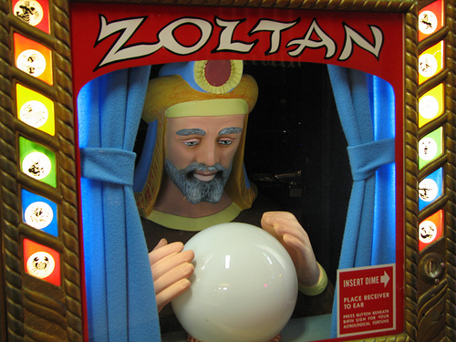
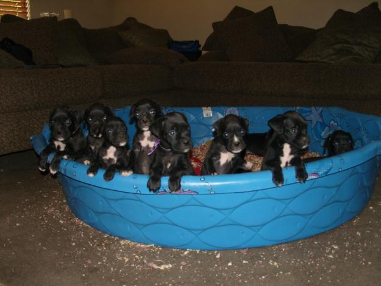
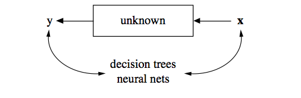
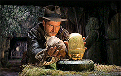
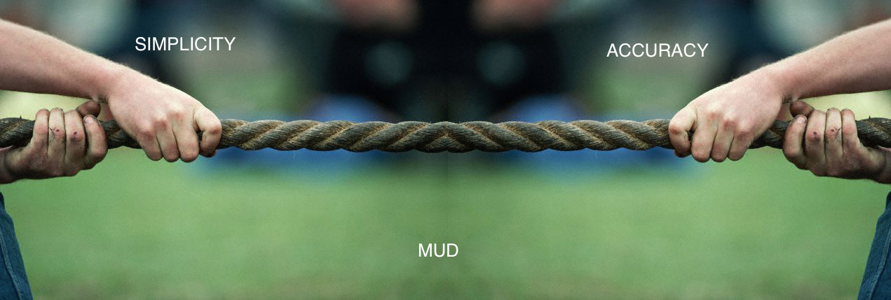
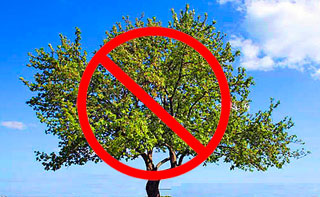
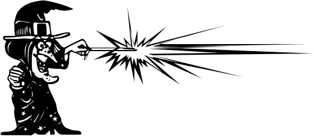

## People Particpating in this work

* Leo Breiman (CART, random forests)
* Sir David Cox (that whole proportional model or Box-Cox transformation)
* Brad Efron (umm... bootstrap, LAR with the Tibshiranis)
* Bruce Hoadley (Asymptotics of MLEs non-iid data; Fair, Isaac model)
* Emanuel Parzen (kernel density estimation, kernel quantile estimators )

--- #slide1

## How most natural processes work

---

## Goals of analyzing data

* _Prediction. To be able to predict what the responses are going to be to future input variables;_

* _Information. To extract some information about how nature is associating the response variables to the input variables._

--- .class #goals

## In one camp we have: Modelers

---

## In one camp we have: Modelers

---

## In one camp we have: Modelers

---

## In one camp we have: Modelers

* _Model validation. Yes–no using goodness-of-fit tests and residual examination._

* _Estimated culture population. 98% of all statisticians._

---

## In the other camp we have: Black Boxers

---

## In the other camp we have: Black Boxers

---

## In the other camp we have: Black Boxers

---

## In the other camp we have: Black Boxers

* _Model validation. Measured by predictive accuracy._
* _Estimated culture population. 2% of statisticians, many in other fields._

---

## What Breiman Learned as a Consultant: Good Guidelines

1.  Focus on finding a <strong>good solution</strong>—that's what consultants (also statisticians) get paid for.
2.  <strong>Live with the data</strong> before you plunge into modeling.
3.  Search for a model that gives a good solution, either <strong>algorithmic or data</strong>.
4.  <strong>Predictive accuracy on test sets</strong> is the criterion for how good the model is.
5.  <strong>Computers</strong> are an indispensable partner.

---

## Concepts Discussed

* Rashomon: the multiplicity of good models; 

* Occam: the conflict between simplicity and accuracy;

* Bellman: dimensionality—curse or blessing?

---

## Rashomon: the multiplicity of good models; 

---

## Rashomon: the multiplicity of good models; 

Small perturbations to the data or selection process can greatly change models.

---

## Rashomon: the multiplicity of good models; 

Small perturbations to the data or selection process can greatly change models.

Breiman suggests aggregating over large set of compteing models: for example in bagging or model stacking

---

## Occam: the conflict between simplicity and accuracy;

Occam’s Razor:  simpler is better. 
"Unfortunately, in prediction, accuracy and simplicity (interpretability) are in conflict."

---

## Occam: the conflict between simplicity and accuracy;

"Accuracy generally requires more complex prediction methods. Simple and interpretable functions do not make the most accurate predictors."

Breiman Report Card:

<table style="width:600px">
<tr>
  <td>Method</td>
  <td>Interpretability </td> 
  <td> Prediction </td>
</tr>
<tr>
  <td>Trees</td>
  <td> </td> 
  <td></td>
</tr>
<tr>
  <td>Random Forests</td>
  <td> </td> 
  <td></td>
</tr>
</table>

---

## Quick Aside: Trees

---

## Quick Aside: Random Forests

From [http://www.stat.berkeley.edu/~breiman/RandomForests/cc_home.htm](http://www.stat.berkeley.edu/~breiman/RandomForests/cc_home.htm)

Each tree is grown as follows:

1.  if the number of cases in the training set is N, sample N cases at random - but with replacement, from the original data. This sample will be the training set for growing the tree.
2.  If there are M input variables, a number m<<M is specified such that at each node, m variables are selected at random out of the M and the best split on these m is used to split the node. The value of m is held constant during the forest growing.
3.  Each tree is grown to the largest extent possible. There is no pruning.

---

## Bellman: dimensionality—curse or blessing?

For decades, the first step in prediction methodologyw
as to avoid the curse.

---

## Bellman: dimensionality—curse or blessing?

For prediction: "Instead of reducing dimensionality, increase it by adding many functions of the predictor variables."s

*The problem is how to extract and put together these little pieces of information.*

---

## Information from a Black Box

* Usually most complex models are most predictive.
* Our problem setup is a black box:

* ML methods are a black box:

_So we are facing two black boxes, where ours seems only slightly less inscrutable than nature’s._

---

## "Doctors can interpret logistic regression"

* _Framing the question as the choice between accuracy and interpretability is an incorrect interpretation of what the goal of a statistical analysis is._

* _The goal is not interpretability, but accurate information._

---

## D.R. Cox

* _Formal models are useful and often almost, if not quite, essential for incisive thinking._
* _Automatic methods for model sleection are to be shunned_

---

## Brad Efron

* Where's my bias-variance tradeoff
  * We know a lot about unbiased estimators, but not much about some ML algorithms
  * Bias is lurking there somewhere
* New Methods always look better than old ones
* Complicated Methods are harder to criticize than simple ones
* Design matters and we're getting some unstructured data that's never heard of "good experimental design"

---

## Bruce Hoadley

* Use medium trees with Generalized Additive models (GAM) in the leaves - that's interpretable
* (to whom exactly?)
* Validate your results a bunch

---

## Emanuel Parzen

* There are way more than 2 cultures
* For example, there is this big quantile regression culture you missed (and I'm a leader in)
* I think 

---

## Breiman rejoinder

* Defines vairable importance based on prediction
* "Statisticians need to become opportunistic"

---

## Thoughts and Discussion

That means you talk

[Back to slide 1](#slide1)

---

## Bonus slide

